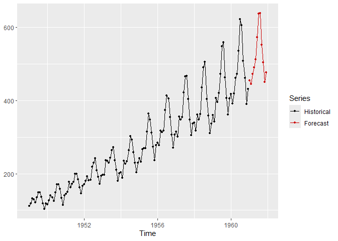

<!-- README.md is generated from README.Rmd. Please edit that file -->

# utsf

<!-- badges: start -->

[](https://github.com/franciscomartinezdelrio/utsf/actions/workflows/R-CMD-check.yaml)
<!-- badges: end -->

The utsf package provides an engine for univariate time series
forecasting using different regression models in an autoregressive way.
The engine provides an uniform interface for applying the different
models. Furthermore, it is extensible so that users can easily apply
their own regression models to univariate time series forecasting and
benefit from all the features of the engine, such as preprocessings or
estimation of forecast accuracy.

## Installation

You can install the development version of utsf from
[GitHub](https://github.com/) with:

``` r
# install.packages("devtools")
devtools::install_github("franciscomartinezdelrio/utsf")
```

## Example

This is a basic example which shows you how to solve a common problem:

``` r
library(utsf)
# Forecast the next 12 future values of time series AirPassengers using random forest
m <- create_model(AirPassengers, method = "rf")
f <- forecast(m, h = 12)
f$pred # to see the forecast
#>           Jan      Feb      Mar      Apr      May      Jun      Jul      Aug
#> 1961 453.9965 445.0194 471.3746 489.6408 511.3382 574.8855 637.5217 636.8638
#>           Sep      Oct      Nov      Dec
#> 1961 550.5418 503.2502 452.0925 475.6288
library(ggplot2)
autoplot(f)
```



If you are interested in this package you can read its vignette where
all its important features are described.
