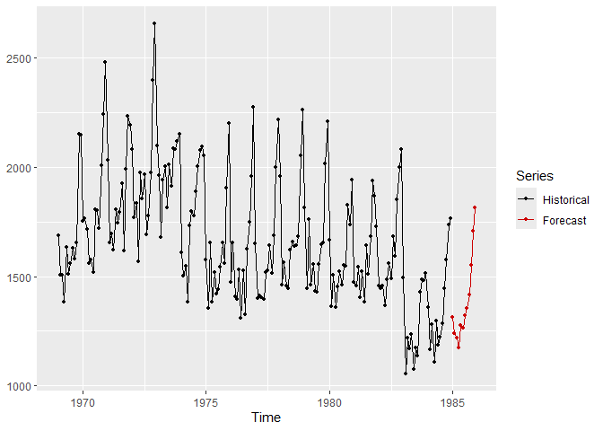

# utsf

<!-- badges: start -->

[](https://github.com/franciscomartinezdelrio/utsf/actions/workflows/R-CMD-check.yaml)
<!-- badges: end -->

The utsf package provides an engine for univariate time series
forecasting using different regression models in an autoregressive way.
The engine provides an uniform interface for applying the different
models. Furthermore, it is extensible so that users can easily apply
their own regression models to univariate time series forecasting and
benefit from all the features of the engine, such as preprocessings or
estimation of forecast accuracy.

## Installation

You can install the **development** version of utsf from
[GitHub](https://github.com/) with:

``` r
# install.packages("pak")
pak::pak("franciscomartinezdelrio/utsf")
```

or you can install the **stable** version from
[CRAN](https://cran.r-project.org/):

``` r
install.packages("utsf")
```

## Example

This is a basic example which shows you how to solve a common problem:

``` r
library(utsf)
# Forecast the next 12 future values of time series UKDriverDeaths using random forest
m <- create_model(UKDriverDeaths, method = "rf")
f <- forecast(m, h = 12)
f$pred # to see the forecast
#>           Jan      Feb      Mar      Apr      May      Jun      Jul      Aug
#> 1985 1299.725 1215.264 1227.347 1170.516 1261.783 1263.307 1325.378 1346.959
#>           Sep      Oct      Nov      Dec
#> 1985 1412.481 1543.708 1698.649 1805.963
library(ggplot2)
autoplot(f)
```



If you are interested in this package you can read its
[vignette](https://cran.r-project.org/package=utsf) where all its
important features are described.
