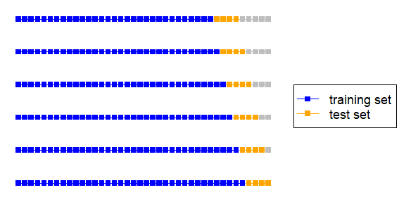
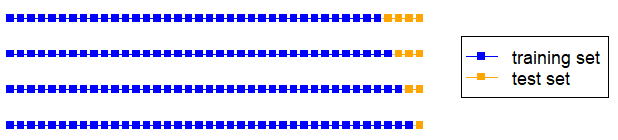

```{r, include = FALSE}
knitr::opts_chunk$set(
  collapse = TRUE,
  comment = "#>"
)
```

```{r setup}
library(utsf)
```

In this document the **utsf** package is described. This package offers a meta engine for applying different regression models for univariate time series forecasting using an autoregressive approach. One main feature of the package is its extensibility, which allow you to use machine learning models not directly supported by the package, such as neural networks, or your own models. Currently, the package is mainly focused on regression tree models. You can consult an explanation of how to forecast univariate time series using regression trees here: https://arxiv.org/abs/2602.00077.

# Univariate time series forecasting ( autoregressive models) and recursive forecasts

An univariate time series forecasting method is one in which the future values of a series are predicted using only information from the series, for example, using as forecast its mean historical value. An advantage of this type of prediction is that, apart from the series being forecast, there is no need to collect any further information in order to train the forecasting model.

An autoregressive model is a kind of univariate time series forecasting model in which a value of a time series is expressed as a function of some of its past values. That is, an autoregressive model is a regression model in which the independent variables are lagged values (previous values) of the response variable. For example, given a time series with the following historical values: $t = \{1, 3, 6, 7, 9, 11, 16\}$, suppose that we want to develop an autoregressive model in which a target "is explained" by its first, second and fourth past values (in this context, a previous value is also called a *lag*, so lag 1 is the value immediately preceding a given value in the series). Given the series $t$ and lags (1, 2 and 4), the training set would be:

| Lag 4 | Lag 2 | Lag 1 | Target |
|-------|-------|-------|--------|
| 1     | 6     | 7     | 9      |
| 3     | 7     | 9     | 11     |
| 6     | 9     | 11    | 16     |

## Recursive forecasts

Given a model trained with the previous dataset, the next future value of the series is predicted as $f(Lag4, Lag2, Lag1)$, where $f$ is the regression function and $Lag4$, $Lag2$ and $Lag1$ are the fourth, second and first lagged values of the next future value. So, the next future value of series $t$ is predicted as $f(7, 11, 16)$, producing a value that will be called $F1$.

Suppose that the *forecast horizon* (the number of future values to be forecast into the future) is greater than 1. In the case that the regression function only predicts the next future value of the series, a recursive approach can be applied to forecast all the future values in the forecast horizon. Using a recursive approach, the regression function is applied recursively until all steps ahead values are forecast. For instance, following the previous example, suppose that the forecast horizon is 3. As we have explained, to forecast the next future value of the series (one-step ahead) the regression function is fed with the vector $[7, 11, 16]$, producing $F1$. To forecast the two-steps ahead value the regression function is fed with the vector $[9, 16, F1]$. The forecast for the one-step ahead value, $F1$, is used as the first lag for the two-steps ahead value, because the actual value is unknown. Finally, to predict the three-steps ahead value the regression function is fed with the vector [$11, F1, F2]$. This example of recursive forecast is summarized in the following table:

|Steps ahead | Autoregressive values | Forecast |
|------------|-----------------------|----------|
| 1          | 7, 11, 16             | F1       |
| 2          | 9, 16, F1             | F2       |
| 3          | 11, F1, F2            | F3       |

The recursive approach for forecasting several values into the future is applied in classical statistical models such as ARIMA or exponential smoothing.

# The utsf package

The **utsf** package makes it easy the use of classical regression models for univariate time series forecasting, employing the autoregressive approach and the recursive prediction strategy explained in the previous section. All the supported models are applied using an uniform interface: 

* the `create_model()` function to build the forecasting model, and 
* the `forecast()` function for using the trained model to predict future values. 

Let us see an example in which a regression tree model is used to forecast the next future values of a time series:

```{r}
m <- create_model(AirPassengers, lags = 1:12, method = "rt")
f <- forecast(m, h = 12)
```

In this example, an autoregressive tree model (`method = "rt"`, Regression Tree) is trained using the historical values of the `AirPassengers` time series and a forecast for its 12 next future values (`h = 12`) is done. The `create_model()` function returns an S3 object of class `utsf` with information about the trained model. The information about the forecast is included in the object returned by the `forecast()` function, as a component named `pred` of class `ts` (a time series):

```{r}
f$pred
library(ggplot2)
autoplot(f)
```

The training set used to fit the model is built from the historical values of the time series using the autoregressive approach explained in the previous section. The `lags` parameter of the `create_model()` function is used to specify the autoregressive lags. In the example: `lags = 1:12`, so a target is a function of its 12 previous values. Next, we consult the first targets (and their associated features) with which the regression model has been trained:

```{r}
head(m$targets)  # first targets
head(m$features) # and its associated features
```

The curious reader might have noticed that the features and targets are not on the same scale as
the original time series. This is because, by default, a transformation is applied to the examples of the training set. This transformation will be explained later.

Let us see the training set associated with the example of the previous section:

```{r}
t <- ts(c(1, 3, 6, 7, 9, 11, 16))
out <- create_model(t, lags = c(1, 2, 4), trend = "none")
cbind(out$features, Target = out$targets)
```

No transformation has been applied this time (`trend = "none"`).

# Prediction intervals

Prediction intervals for a forecast can be computed:

```{r}
m <- create_model(USAccDeaths, method = "mt")
f <- forecast(m, h = 12, PI = TRUE, level = 90)
f
library(ggplot2)
autoplot(f)
```

Prediction intervals are calculated following the guidelines in (https://otexts.com/fpp3/nnetar.html#prediction-intervals-5). Random errors are assumed to follow a normal distribution. In the example, a 90% prediction interval (`level = 90`) has been computed.

# Supported models

The `create_model()` and `forecast()` functions provide a common interface to applying an autoregressive approach for time series forecasting using different regression models. These models are implemented in several R packages. Currently, our project is mainly focused on regression tree models, supporting the following approaches:

* k-nearest neighbors: In this case no model is trained and the function `FNN::knn.reg()` is used, as regression function, to recursively predict the future values of the time series.
* Linear models: The model is trained using the function `stats::lm()` and its associated method
`stats::predict.lm()` is applied recursively for the forecasts, i.e., as regression function.
* Regression trees: The model is trained using the function `rpart::rpart()` and its associated method `rpart::predict.rpart()` is used for the forecasts.
* Model trees: The model is trained with the function `Cubist::cubist()` and its associated method `Cubist::predict.cubist()` is used for predictions.
* Bagging: The model is trained with the function `ipred::bagging()` and its
  associated method `ipred::predict.regbagg()` is used for forecasting.
* Random forest: The model is trained with the function `ranger::ranger()` and its associated method `ranger::predict.ranger()` is used for predictions.

The S3 object of class `utsf` returned by the `create_model()` function contains a component with the trained autoregressive model:

```{r}
m <- create_model(fdeaths, lags = 1:12, method = "rt")
m$model
```

In this case, the model is the result of training a regression tree  using the function `rpart::rpart()` with the training set consisting of the features `m$features` and targets `m$targets`. Once the model is trained, the `rpart::predict.rpart()` function can be used recursively to forecast the future values of the time series using the `forecast()` function.

# Using your own models

An interesting feature of the **utsf** package is its extensibility. Apart from the models directly supported by the package, you can use the facilities of the package to do autoregressive time series forecasting using your own regression models. Thus, your models can benefit from the features implemented in the package, such as the building of the training set, the implementation of recursive forecasts, pre-processings, the estimation of forecast accuracy or parameter tuning.

To apply your own regression model you have to use the `method` parameter of the `create_model()` function, providing as argument a function that is able to train your model. We will call this function the *modeling function* and it must return an object with the trained regression model. The modeling function must have three input parameters:

* `X`: it is a data frame with the features of the training examples. This data frame is built from the time series taking into account the autoregressive lags as explained in a previous section. This is the same object as the `features` component of the object returned by the `create_model()` function.
* `y`: a vector with the targets of the training examples. It is built as explained in a previous section. It is the same object as the `targets` component of the object returned by the `create_model()` function.
* `...`: for receiving additional arguments to adjust the behavior of the model. This parameter will not be used in this section and will be explained in the next section.

Furthermore, if the modeling function returns a model of class `model_class`, a method with the signature `predict.model_class(object, new_value)` should be implemented. This method uses your model to predict a new value, that is, it is the regression function associated with the model. Let us explain the parameters of this regression function:

* `object`: it is the object of class `model_class` returned by your function that creates the model.
* `new_value`: it is a data frame with the same structure as the `X` parameter of the function for building the model. The `new_value` data frame has only one row, with the features of the example to be predicted. 

Summing up, in order to use your regression model you have to provide:

* A modeling function that, given the training set, trains the model.
* A regression function that, given a trained model and a new vector of features, predicts a value.

Let us see several examples of how to use this functionality for applying your own models for autoregressive time series forecasting taking advantage of the capabilities of the **utsf** package.

## Example 1: k-nearest neighbors

The case of K-nearest neighbors is a bit special because it is a lazy learner and no model is built. You only need to store the training set and all the work is done by the regression function. Let us see a first example in which we rely on the implementation of k-NN in the **FNN** package:

```{r}
# Modeling function: in this case (k-NN) just stores the training set
my_knn_model <- function(X, y, ...) { structure(list(X = X, y = y), class = "my_knn") }

# Regression function
predict.my_knn <- function(object, new_value) {
  FNN::knn.reg(train = object$X, test = new_value, y = object$y)$pred
}

m <- create_model(AirPassengers, lags = 1:12, method = my_knn_model)
f <- forecast(m, h = 12)
f$pred
autoplot(f)
```

The modeling function (`my_knn_model()`) creates a "model" that only stores the training set. The regression function (`predict.my_knn()`) takes advantage of the `FNN::knn.reg()` function to look for the k-nearest neighbors and compute their mean response value. The default number of neighbors (3) of `FNN::knn.reg()` is used. Later, we will modify this example so that the user can select the $k$ value.

The k-nearest neighbors algorithm is so simple that it can be easily implemented without using functionality from any R package:

```{r}
# Modeling function
my_knn_model2 <- function(X, y, ...) {
  structure(list(X = X, y = y), class = "my_knn2")
}

# Regression function
predict.my_knn2 <- function(object, new_value) {
  k <- 3 # number of nearest neighbors
  distances <- sapply(1:nrow(object$X), function(i) sum((object$X[i, ] - new_value)^2))
  k_nearest <- order(distances)[1:k]
  mean(object$y[k_nearest])
}

m2 <- create_model(AirPassengers, lags = 1:12, method = my_knn_model2)
forecast(m2, h = 12)$pred
```
## Example 2: random forest and neural networks

The random forest algorithm is directly supported in the **utsf** package, using the implementation of random forests in the `ranger` package. Here, we are going to create an autoregressive model based on the random forest model implemented in the `RandomForest` package:

```{r}
library(randomForest)
my_model <- function(X, y, ...) { randomForest(x = X, y = y) }
m <- create_model(USAccDeaths, lags = 1:12, method = my_model)
f <- forecast(m, h = 12)
library(ggplot2)
autoplot(f)
print(m$model)
```

The modeling function (`my_model()`) just uses the `randomForest::randomForest()` function. This function returns an S3 object of class `randomForest` with the trained model. In this case, we have not implemented the regression function, because the `predict.randomForest()` method does exactly what we want.

As another example, we are going to use a neural network model implemented in the *nnet* package:

```{r}
library(nnet)
my_model <- function(X, y, ...) {
  nnet(x = X, y = y, size = 5, linout = TRUE, trace = FALSE)
}
m <- create_model(USAccDeaths, lags = 1:12, method = my_model)
f <- forecast(m, h = 12)
library(ggplot2)
autoplot(f)
```

In this case, the `nnet()` function returns an S3 object of class `nnet`. Again, the regression method associated with this class, `predict.nnet()`,  is what we need as regression function. Because we are using neural networks, probably some pre-processing would be needed to obtain more accurate predictions. 

## Example 3: Extreme gradient boosting

In this case we are going to apply the extreme gradient boosting model implemented in the `xgboost` package. We rely on the `xgboost::xgboost()` function to build the model. This function returns an object of class `xgb.Booster` with the trained model. However, we cannot use the `xgboost::predict.xgb.Booster()` as regression function, because the `newvalue` parameter of this function cannot be a data frame. Let us see how we get around this problem:

```{r}
library(xgboost)
# Modeling function
my_model <- function(X, y, ...) {
  m <- xgboost(x = as.matrix(X), 
               y = y, 
               nrounds = 100
  )
  structure(m, class = "my_model")
}
# Regression function
predict.my_model <- function(object, new_value) {
  class(object) <- "xgb.Booster"
  predict(object, as.matrix(new_value))
}
m <- create_model(AirPassengers, method = my_model)
f <- forecast(m, h = 12)
library(ggplot2)
autoplot(f)
```

The trick is that, in the modeling function (`my_model()`), we change the class of the object (model) returned by `xgboost()` to class `my_model`, so that we can provide our own regression function (`predict.my_model()`). In this function we change again the class of the model to use the original regression function: `predict.xgb.Booster()`, but we convert the `new_value` from a data frame to a matrix that is a format expected by `predict.xgb.Booster()`.

# Setting the parameters of the regression models

Normally, a regression model can be adjusted using different parameters. By default, the models supported by our package are set using some specific parameters, usually the default values of the functions used to train the models (these functions are listed in a previous section). However, the user can select these parameters. Let us see an example:

```{r}
# A bagging model set with default parameters
m <- create_model(USAccDeaths, lags = 1:12, method = "bagging")
length(m$model$mtrees) # number of regression trees (25 by default)
# A bagging model set with 3 regression trees
m2 <- create_model(USAccDeaths,
                   lags = 1:12,
                   method = "bagging",
                   nbagg = 3
)
length(m2$model$mtrees) # number of regression trees
```

In the previous example, two bagging models (using regression trees) are trained with the `create_model()` function. In the first model the number of trees is 25, the default value of the function `ipred::ipredbagg()` used to train the model. In the second model the number of trees is set to 3. Of course, in order to set some specific parameters the user must consult the parameters of the function used internally by the **utsf** package to train the model. In the example, the `ipred::ipredbagg()` function has a parameter named `nbagg` to set the number of regression trees.

## Setting the paramaters of a regression model supplied by the user

When the regression model is provided by the user, it is also possible to adjust its parameters. As explained previously, if you want to use your own regression model you have to provide a modeling function. This function has tree parameters:

* `X`: to receive the training features
* `y`: to receive the targets
* `...`: additional arguments for adjusting the model. 

The `...` parameter allows the modeling function to receive a variable name of arguments for adjusting the model.

Let us see some example of passing arguments to some of the regression models implemented in the previous section.

### Example 1: k-nearest neighbors

In this case the model can be adjusted specifying the $k$ value. The function provided to train the model can be tuned with an argument named `k` with the number of nearest neighbors:

```{r}
# Function to train the model
my_knn_model <- function(X, y, ...) {
  param <- list(...)
  k <- if ("k" %in% names(param)) param$k else 3
  structure(list(X = X, y = y, k = k), class = "my_knn")
}

# Regression function for object of class my_knn
predict.my_knn <- function(object, new_value) {
  FNN::knn.reg(train = object$X, test = new_value,
               y = object$y, k = object$k)$pred
}

# The model is trained with default parameters (k = 3)
m <- create_model(AirPassengers, lags = 1:12,  method = my_knn_model)
print(m$model$k)
# The model is trained with k = 5
m2 <- create_model(AirPassengers, method = my_knn_model, k = 5)
print(m2$model$k)
```

The additional arguments set in the `create_model()` function (in this case, `k = 5`) are passed to the modeling function (in this case, `my_knn_model()`).

### Example 2: random forest

As another example, suppose that we create a random forest model using the functionality in the *randomForest* package. By default, we will use the default parameters of the `randomForest::randomForest()` function to build the model, save for the number of trees (it will be set to 200). However, the user can train the model with other values:

```{r}
library(randomForest)
my_model <- function(X, y, ...) {
    param <- list(...)
    args <- list(x = X, y = y, ntree = 200) # default parameters
    args <- args[!(names(args) %in% names(param))]
    args <- c(args, param)
    do.call(randomForest::randomForest, args = args)
}
# The random forest is built with our default parameters
m <- create_model(USAccDeaths, method = my_model)
print(m$model$ntree)
print(m$model$mtry)
# The random forest is built with ntree = 400 and mtry = 6
m <- create_model(USAccDeaths, method = my_model, ntree = 400, mtry = 6)
print(m$model$ntree)
print(m$model$mtry)
```

# Estimating forecast accuracy

This section explains how to estimate the forecast accuracy of a regression model predicting a time series with the **utsf** package. Let us see an example:

```{r}
m <- create_model(UKgas, lags = 1:4, method = "knn")
r <- efa(m, h = 4, type = "normal", size = 8)
r$per_horizon
r$global
```

To assess the forecast accuracy of a model you should use the `efa()` function on the model. In this case, the forecasting method is a K-nearest neighbors algorithm (`method = "knn"`), with autoregressive lags 1 to 4, applied on the `UKgas` time series. An estimation of its forecast accuracy on the series for a forecasting horizon of 4 (`h = 4`) is obtained according to different forecast accuracy measures. The `efa()` function returns a list with two components. The component named `per_horizon` contains the forecast accuracy estimations per forecasting horizon. The component named `global` is computed as the means of the rows of the `per_horizon` component. Currently, the following forecast accuracy measures are computed:

* MAE: mean absolute error
* MAPE: mean absolute percentage error
* sMAPE: symmetric MAPE
* RMSE: root mean squared error

Next, we describe how the forecasting accuracy measures are computed for a forecasting horizon $h$ ($y_t$ and $\hat{y}_t$ are the actual future value and its forecast for horizon $t$ respectively):

$$
MAE = \frac{1}{h}\sum_{t=1}^{h} |y_t-\hat{y}_t|
$$

$$
MAPE = \frac{1}{h}\sum_{t=1}^{h} 100\frac{|y_t-\hat{y}_t|}{y_t}
$$
$$
sMAPE = \frac{1}{h}\sum_{t=1}^{h} 200\frac{\left|y_{t}-\hat{y}_{t}\right|}{|y_t|+|\hat{y}_t|}
$$

$$
RMSE = \sqrt{\frac{1}{h}\sum_{t=1}^{h} (y_t-\hat{y}_t)^2}
$$

The estimation of forecast accuracy is done with the well-known rolling origin evaluation. This technique builds several training and test sets from the series, as shown below for a forecasting horizon of 4:

```{r out.width = '85%', echo = FALSE}

```

In this case, the last nine observations of the series are used to build the test sets. Six models are trained using the different training sets and their forecasts are compared to their corresponding test sets. Thus, the estimation of the forecast error for every forecasting horizon is based on six errors (it is computed as the mean).

You can specify how many of the last observations of the series are used to build the test sets with the `size` and `prop` parameters. For example:

```{r, eval = FALSE}
m <- create_model(UKgas, lags = 1:4, method = "knn")
# Use the last 9 observations of the series to build test sets
r1 <- efa(m, h = 4, type = "normal", size = 9)
# Use the last 20% observations of the series to build test sets
r2 <- efa(m, h = 4, type = "normal", prop = 0.2)
```

If the series is short, the training sets might be too small to fit a meaningful model. In that case, a special rolling origin evaluation can be done, setting parameter `type` to `"minimum"`:

```{r}
m <- create_model(UKgas, lags = 1:4, method = "knn")
r <- efa(m, h = 4, type = "minimum")
r$per_horizon
r$global
```

When this option is chosen, the last `h` observations (in the example 4) are used to build the training sets as is shown below for `h = 4`:

```{r out.width = '85%', echo = FALSE}

```

In this case, the estimated forecast error for horizon 1 is based on 4 errors, for horizon 2 is based on 3 errors, for horizon 3 on 2 errors and for horizon 4 on 1 error.

The `efa()` function also returns the test sets (and the predictions associated with them) used when assessing the forecast accuracy:

```{r}
timeS <- ts(1:25)
m <- create_model(timeS, lags = 1:3, method = "mt")
r <- efa(m, h = 5, size = 7)
r$test_sets
r$predictions
```

Each row in these tables represent a test set or prediction. Let us see the test sets when the "minimum" evaluation is done:

```{r}
timeS <- ts(1:25)
m <- create_model(timeS, lags = 1:3, method = "mt")
r <- efa(m, h = 3, type = "minimum")
r$test_sets
r$predictions
```

# Parameter tuning

Another useful feature of the **utsf** package is parameter tuning. The `tune_grid()` function allows you to estimate the forecast accuracy of a model using different combinations of parameters. Furthermore, the combination of parameters that gets the best forecast accuracy estimation is used to train a model with all the historical values of the series and the model is applied for forecasting the future values of the series. Let us see an example:

```{r}
m <- create_model(UKgas, lags = 1:4, method = "knn")
r <- tune_grid(m, h = 4, tuneGrid = expand.grid(k = 1:7), type = "normal", size = 8)
# To see the estimated forecast accuracy with the different configurations
r$tuneGrid
```

In this example, the `tuneGrid` parameter is used to specify (using a data frame) the set of parameters to assess. The forecast accuracy of the model for the different combinations of parameters is estimated as explained in the previous section using the last observations of the time series as validation set. The `size` parameter is used to specify the size of the test set. The `tuneGrid` component of the list returned by the `tune_grid()` function contains the result of the estimation. In this case, the k-nearest neighbors method using $k=1$ obtains the best results for all the forecast accuracy measures (this is due to the increasing variance of the series). The best combination of parameters according to RMSE is used to forecast the time series:

```{r}
r$best
r$forecast
```

Let us plot the values of $k$ against their estimated accuracy using RMSE:

```{r}
plot(r$tuneGrid$k, r$tuneGrid$RMSE, type = "o", pch = 19, xlab = "k (number of nearest neighbors)", ylab = "RMSE", main = "Estimated accuracy")
```

Let us now see an example in which more than one tuning parameter is used. In this case we use a random forest model and three tuning parameters:

```{r}
m <- create_model(UKDriverDeaths, lags = 1:12, method = "rf")
r <- tune_grid(m, 
               h = 12, 
               tuneGrid = expand.grid(num.trees = c(200, 500), replace = c(TRUE, FALSE), mtry = c(4, 8)),
               type = "normal", 
               size = 12
)
r$tuneGrid
```

# Preprocessings and transformations

Sometimes, the forecast accuracy of a model can be improved by applying some transformations and/or preprocessings to the time series being forecast. Currently, the **utsf** package is focused on preprocessings related to forecasting time series with a trend. This is due to the fact that, at present, most of the models incorporated in our package (such as regression trees and k-nearest neighbors) predict averages of the targets in the training set (i.e., an average of historical values of the series). In a trended series these averages are probably outside the range of the future values of the series. Let us see an example in which a trended series (the yearly revenue passenger miles flown by commercial airlines in the United States) is forecast using a random forest model:

```{r}
m <- create_model(airmiles, lags = 1:4, method = "rf", trend = "none")
f <- forecast(m, h = 4)
autoplot(f)
```

In this case, no preprocessing is applied for dealing with the trend (`trend = "none"`). It can be observed how the forecast does not capture the trending behavior of the series because regression tree models predict averaged values of the training targets.

In the next subsections we explain how to deal with trended series using three different transformations.

## Differencing

A common way of dealing with trended series is to transform the original series taking first differences (computing the differences between consecutive observations). Then, the model is trained with the differenced series and the forecasts are back-transformed. Let us see an example:

```{r}
m <- create_model(airmiles, lags = 1:4, method = "rf", trend = "differences", nfd = 1)
f <- forecast(m, h = 4)
autoplot(f)
```

In this case, the `trend` parameter has been used to specify first-order differences (`trend = "differences"`). The order of first differences is specified with the `nfd` parameter (it will be normally 1). It is also possible to specify the value -1, in which case the order of differences is estimated using the `ndiffs()` function from the **forecast** package (in that case, the chosen order of first differences could be 0, that is, no differences are applied).

```{r}
# The order of first differences is estimated using the ndiffs function
m <- create_model(airmiles, lags = 1:4, method = "rf", trend = "differences", nfd = -1)
m$differences
```

## The additive transformation

This transformation has been used to deal with trending series in other R packages, such as **tsfknn** or **tsfgrnn**. The additive transformation works transforming the targets of the training set as follows:

* The target associated with a vector of features is transformed by subtracting from it the mean of its vector of features.
* To back transform a prediction, the mean of the input vector is added to it.

It is easy to check how the training examples are modified by the additive transformation using the API of the package. For example, let us see the training examples of a model with no transformation:

```{r}
timeS <- ts(c(1, 3, 7, 9, 10, 12))
m <- create_model(timeS, lags = 1:2, trend = "none")
cbind(m$features, Targets = m$targets)
```

Now, let us see the effect of the additive transformation in the training examples:

```{r}
timeS <- ts(c(1, 3, 7, 9, 10, 12))
m <- create_model(timeS, lags = 1:2, trend = "additive", transform_features = FALSE)
cbind(m$features, Targets = m$targets)
```

Apart from transforming the targets, it is also possible to transform the features. A vector of features is transformed by substracting the mean of the vector. Let us see the effects of this transformation:

```{r}
timeS <- ts(c(1, 3, 7, 9, 10, 12))
m <- create_model(timeS, lags = 1:2, trend = "additive", transform_features = TRUE)
cbind(m$features, Targets = m$targets)
```

The point of transforming the features is to remove the effects of the level of the series in the feature space. Our experience tells us that transforming the features tends to improve forecast accuracy. 

Next, we forecast the airmiles series using the additive transformation and a random forest model:

```{r}
m <- create_model(airmiles, lags = 1:4, method = "rf")
f <- forecast(m, h = 4)
autoplot(f)
```

By default, the additive transformation is applied to both targets and features.

## The multiplicative transformation

The multiplicative transformation is similar to the additive transformation, but it is intended for series with an exponential trend (the additive transformation is suited for series with a linear trend). In the multiplicative transformation a training example is transformed this way:

* The target associated with a vector of features is transformed by dividing it by the mean of its associated vector of features.
* To back transform a prediction, the prediction is multiplied by the mean of the input vector.
* Optionally, a vector of features is transformed by dividing it by its mean.

Let us see an example of an artificial time series with a multiplicative trend and its forecast using the additive and the multiplicative transformation:

```{r}
t <- ts(10 * 1.05^(1:20))
m_m <- create_model(t, lags = 1:3, method = "rf", trend = "multiplicative")
f_m <- forecast(m_m, h = 4)
m_a <- create_model(t, lags = 1:3, method = "rf", trend = "additive")
f_a <- forecast(m_a, h = 4)
library(vctsfr)
plot_predictions(t, predictions = list(Multiplicative = f_m$pred, Additive = f_a$pred))
```

In this case, the forecast with the multiplicative transformation captures perfectly the exponential trend.

As another example, let us compare the additive and multiplicative transformation applied to the `AirPassengers` series. This monthly series has an exponential trend.

```{r, fig.width= 6}
m_m <- create_model(AirPassengers, lags = 1:12, method = "knn", trend = "multiplicative")
f_m <- forecast(m_m, h = 36)
m_a <- create_model(AirPassengers, lags = 1:12, method = "knn", trend = "additive")
f_a <- forecast(m_a, h = 36)
library(vctsfr)
plot_predictions(AirPassengers, predictions = list(Multiplicative = f_m$pred, Additive = f_a$pred))
```


# Default parameters

The `create_model()` function only has one compulsory parameter: the time series with which the model is trained. Next, we discuss the default values for the rest of its parameters:

* `lags`: The `lags` parameter is an integer vector with the autoregressive lags. If `frequency(ts) == f` where `ts` is the time series being forecast and $f > 1$ then the lags used as autoregressive features are 1:*f*. For example, the lags for quarterly data are 1:4 and for monthly data 1:12. This is useful to capture a possible seasonal behavior of the series. If `frequency(ts) == 1`, then:
    * The lags with significant autocorrelation in the partial autocorrelation function (`stats::pacf()`) are selected.
    * If no lag has a significant autocorrelation, then lags 1:5 are chosen.
    * If only one lag has significant autocorrelation and the additive or multiplicative transformation is applied to both the targets and the features, then lags 1:5 are chosen. This is done because it does not make sense to use these transformations with the features when only one autoregressive lag is used.
* `method`: By default, the K-nearest neighbors algorithm is applied.
* `trend`: The additive transformation is applied. This transformation have proved its effectiveness to forecast trending series. In general, its application seems beneficial on any kind of series.
* `transform_features`: Its default value is `TRUE`, so that if a series is transformed with the additive or multiplicative transformation both its features and targets are transformed.
